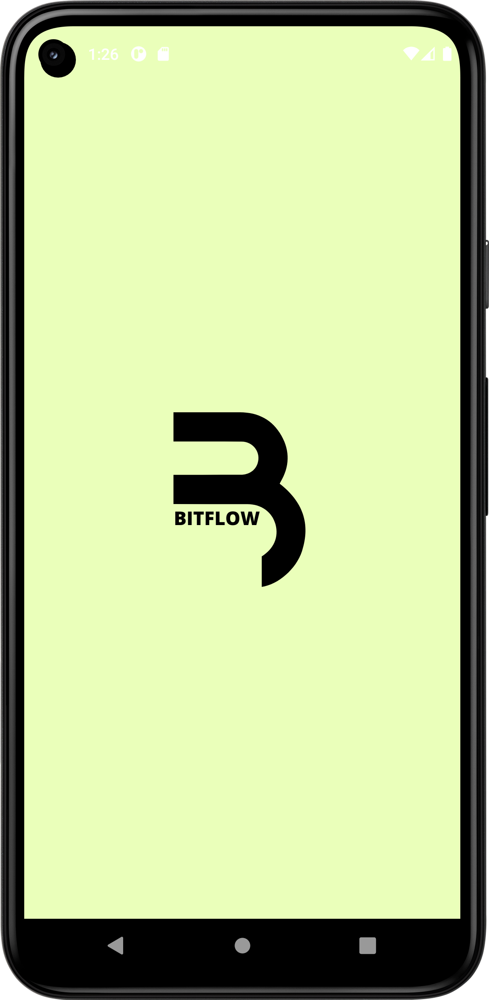
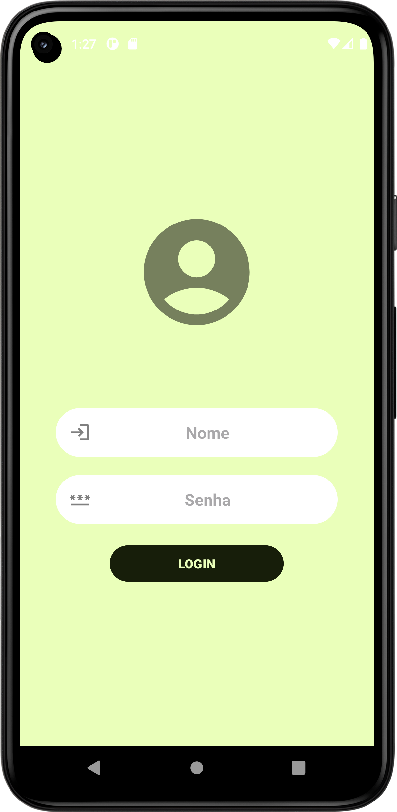
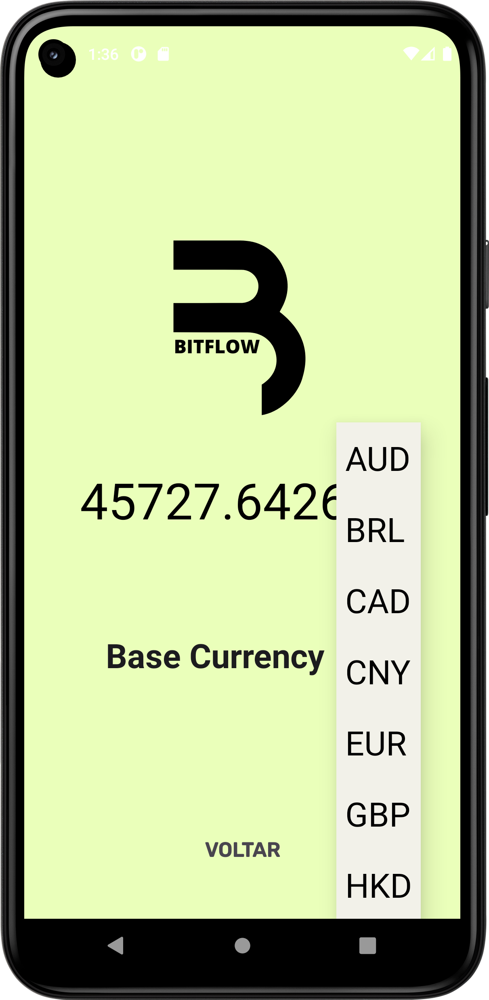

# BitFlow
BitFlow foi um aplicativo que nos desenvolvemos durante a primeira Hacksprint da comunidade DevSpace.

A ideia da Hacksprint foi para que os membros da comunidade pudessem se desafiar e aperfeiçoar seus conhecimentos de trabalho em equipe, e tambem, a buscar novos conhecimentos.

# 📸 Screenshots
<!-- You can add more screenshots here if you like -->
   

# Tecnologias
* Kotlin
* Layouts
    * ConstraintLayout
    * SwipeRefreshLayout
- Componentes UI
    - LineChart
    - TextView
    - Vectors
    - Button
    - EditText
    - ProgressBar
- Snackbar para mostrar mensagem
- SplashScreen
- Consumo de RESTFul API com Retrofit
- ViewBinding
- MVVM clean archictecture
    - ViewModel
    - LiveData
    - Repository pattern
- Offline First
   - ROOM Database (para armanezar dados da API e mostrar para o usuario)
     
# TODO
- Implementar Firebase Auth para usuario poder ter uma conta no App
- Utilizar radio buttons e fragments para que o usuario possa ver o preco do Bitcoin em diversos time ranges

# Author
Gabriel Levindo de souza (follow me on [Linkedin](linkedin.com/in/gabrielslevindo))

Bernardo Oechsler (follow me on [Linkedin](https://www.linkedin.com/in/bernardo-oechsler-b84995194))


## License
```
The MIT License (MIT)

Copyright (c) 2023 Bernardo Oechsler; Gabriel Levindo.
Permission is hereby granted, free of charge, to any person obtaining a copy of
this software and associated documentation files (the "Software"), to deal in
the Software without restriction, including without limitation the rights to
use, copy, modify, merge, publish, distribute, sublicense, and/or sell copies of
the Software, and to permit persons to whom the Software is furnished to do so,
subject to the following conditions:

The above copyright notice and this permission notice shall be included in all
copies or substantial portions of the Software.

THE SOFTWARE IS PROVIDED "AS IS", WITHOUT WARRANTY OF ANY KIND, EXPRESS OR
IMPLIED, INCLUDING BUT NOT LIMITED TO THE WARRANTIES OF MERCHANTABILITY, FITNESS
FOR A PARTICULAR PURPOSE AND NONINFRINGEMENT. IN NO EVENT SHALL THE AUTHORS OR
COPYRIGHT HOLDERS BE LIABLE FOR ANY CLAIM, DAMAGES OR OTHER LIABILITY, WHETHER
IN AN ACTION OF CONTRACT, TORT OR OTHERWISE, ARISING FROM, OUT OF OR IN
CONNECTION WITH THE SOFTWARE OR THE USE OR OTHER DEALINGS IN THE SOFTWARE.
```
